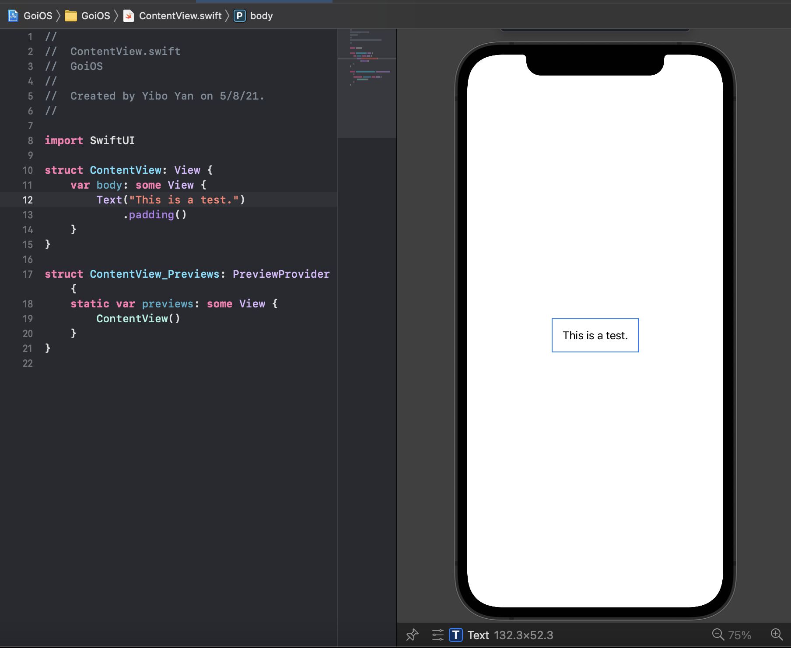
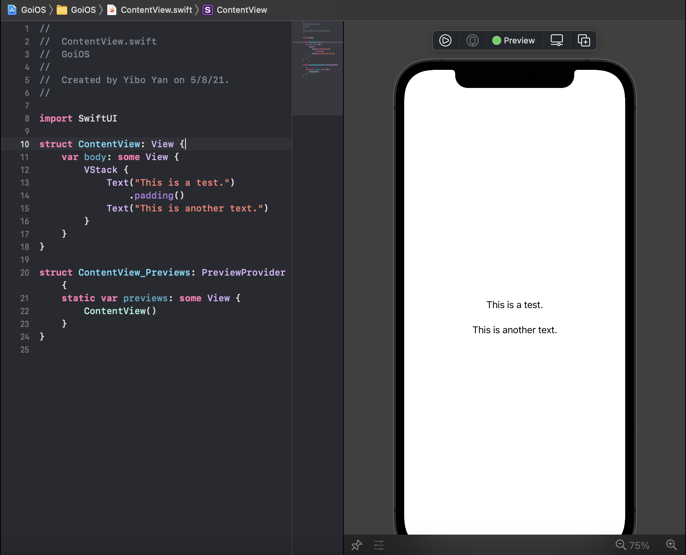

0. this unordered seed list will be replaced by toc as unordered list
{:toc}

## How a SwiftUI view is constructed?

Let's open the project created in the last post and navigate to the `ContentView.swift` file. Take a look at the code it generated. It should be something like this:

``` swift
// file: 'ContentView.swift'
import SwiftUI

struct ContentView: View {
    var body: some View {
        Text("Hello, world!")
            .padding()
    }
}

struct ContentView_Previews: PreviewProvider {
    static var previews: some View {
        ContentView()
    }
}
```

The `import SwiftUI` statement is used to import libraries used for SwiftUI, just like `#include` in cpp, `using` in C#, or `import` in Java and Python.

The most important thing is the struct named as `ContentView` declared here.

``` swift
// file: 'ContentView.swift'
...
struct ContentView: View {
    var body: some View {
        Text("Hello, world!")
            .padding()
    }
}
...
```

This is the standard way of declaring a SwiftUI view. Variable `body` is a special kind of variable called *computed variable* in Swift. In this case, it returns a `Text`, which is a view predefined in the SwiftUI standard library. There are lots of things going on under the hood, such as `protocol` named as `View`, `some` keyword, `padding()` as `ViewModifier`. I will not go more deep about these concept right now. More detail will be discussed in the future post. For now, you can just get familiar with the structure of defining a SwiftUI view and learn how to write some basic views.

Let's take a brief look at the next part:

``` swift
// file: 'ContentView.swift'
...
struct ContentView_Previews: PreviewProvider {
    static var previews: some View {
        ContentView()
    }
}
...
```

There is another struct named as `ContentView_Previews` which conforms to `PreviewProvider`. As long as you declared such struct, conforming to `PreviewProvider`, Xcode will automatically know you created a preview instance, and will also open up preview window on the side of code editor. (Unless you manually close or disable it.)

## How to use / edit `Text` view?

Let's change the line of code `Text("Hello, world!")` to something else. For example, I can go with `Text("This is a test.")`. Now, check out the preview panel. (You might need to click `resume` to resume the automatic preview.)



You shall see the preview has been updated! Create a text on the screen with SwiftUI is that easy!

## Let's create multiple `Text`!

Single one `Text` view seems boring. Let's make more `Text` views. How to add one more `Text` view? Just adding one more line of `Text()`, like this:

``` swift
// file: 'ContentView.swift'
...
var body: some View {
    Text("This is a test.")
        .padding()
    Text("This is another text.")
}
...
```

Well, it doesn't seem right, is it? It might receive an error or you might see two previews show up in your preview panel. What's going on here?

The problem is, the SwiftUI doesn't know how to arrange your view. When you have only one `Text`, SwiftUI go by default to place it right at the center of the screen (both vertically and horizontally.) However, when you put two `Text` views or any other views, SwiftUI can get really confused, as you didn't tell it how to arrange your UI. Here comes the `Stack`. Here are three `Stack`s avaliable.

- `VStack`  
  Arrange the SwiftUI views from top to bottom based on the declared order inside the code.

- `HStack`
  Arrange the SwiftUI views from leading to trailing based on the declared order inside the code.

  *Note: the reason why I use leading and trailing, instead of left and right is because Apple considers some languages have different direction of flow. So the left and right can be ambiguous. Leading means the start direction of a certain language, and trailing means the end direction of a certain language. SwiftUI will automatically adjust the arrangement of your UI for different locales.*

- `ZStack`
  Arrange the SwiftUI views from behind to front based on the declared order inside the code.

  *Note: namely, the previous declared UI might be covered by later declared UI*

## Try out `VStack`

Let's wrap our two `Text` views inside one `VStack`. Like this:

``` swift
// file: 'ContentView.swift'
...
struct ContentView: View {
    var body: some View {
        VStack {
            Text("This is a test.")
                .padding()
            Text("This is another text.")
        }
    }
}
...
```



Okay! It correctly displayed on the screen, arranging two `Text` views from the top to bottom based on the declaration order of these views!

## Ending

That's all for this post. Please always try to infer how SwiftUI shall layout the UI for you, as in that way, you can be more clear about why the layout doesn't work and figure out which part of codes break your app.

<!-- 
Continue with [Config](config.md){:.heading.flip-title}
{:.read-more} -->
