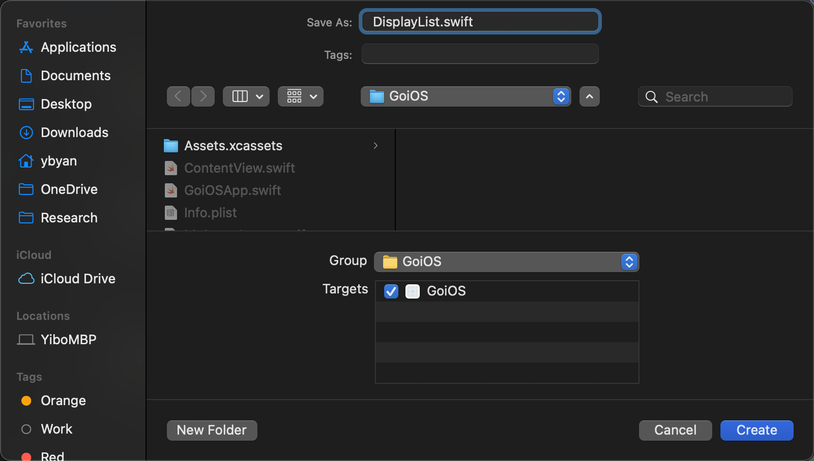

1. this unordered seed list will be replaced by toc as unordered list
{:toc}

## Let's create a new SwiftUI view first!

This time, we will work on a separate SwiftUI view file instead of the `ContentView.swift`.

First, right click on the folder you want to place your file in. For example, right click on `GoiOS` folder as shown by the picture, and click `New File...`:


After the popup window show up, you select `SwiftUI View`, like this:


After clicking on next, fill in the name you want it to be and also pick the location you want to place the file. To avoid further confusion here, I will just use the default location. I name the file as `DisplayList.swift`, Like this:



Click on `Create` when you are done. After that, use the navigation panel to navigate to this newly created file and let's do some codings.

## Let's create a list of simple data in Swift!

Let's create a list of `String`s, like this:

``` swift
// file: 'DisplayList.swift'
...
struct DisplayList: View {
    let listInfo: [String] = [
        "This is list 1",
        "This is list 2",
        "This is list 3",
        "This is list 4"
    ]
    
    var body: some View {
        ...
    }
}
...
```

After we have a list of data, we need to find a way to display them.

## Introducing `List` in SwiftUI!

Let's try to use `List` to display this list of data. The usage is like this:

``` swift
// file: 'DisplayList.swift'
...
var body: some View {
    List(listInfo, id: \.self) { data in
        Text(data)
    }
}
...
```

There are some new key concepts here. Let's walk it through together.   
- The first argument passed in is the list of data itself, which is quite straightforward. 
- As for the second argument, `id: \.self`, this is new. There are two major questions. First, what is id and why it needs a id. Second, what is `\.self`.
  - The reason why `List` needs id as argument is that `List` needs id to identify all different, unique elements inside the `List`. With a proper id, `List` will be able to figure out how to layout all different data elements properly and efficiently. If possible, I might discuss more about potential problems of misusing id.
  - As for the special syntax `\.self`, this is called **Key Path** in Swift. If you want a detailed explanation, you can check out the [official doc](https://docs.swift.org/swift-book/ReferenceManual/Expressions.html) (this is a long doc, you can search keyword "*key-path expression*"). In short, this is way to tell the compiler which field you want to access in terms of this instance. In this case, we want to use this object itself as its id.
- The third argument, also is a closure, is the place where you define how you want to display each of your data. In my code, I simply display them as a `Text`.

The preview of this code should be something like this:


## Let's make it possible to dynamically add elements!

First, we need to add a `Button` to make us be able to add new element into the list.

The way of adding this `Button` depends on you. You can be creative and apply what you have learned to do something fancy. Anyway, here is what I did:

``` swift
// file: 'DisplayList.swift'
...
var body: some View {
    VStack {
        Button("Click to Add") {
            listInfo.append("This is list \(listInfo.count + 1)")
        }

        List(listInfo, id: \.self) { data in
            Text(data)
        }
    }
    
}
...
```

If you are new to Swift, then you might need to know "String interpolation". You can find more information from this [awesome website](https://www.hackingwithswift.com/read/0/5/string-interpolation). In short, `\()` syntax in Swift will plug the string version of statement inside the `\()` into the original string. In other words, another way of combining strings.


After doing all these, you might still get an error like this:

> Cannot use mutating member on immutable value: 'listInfo' is a 'let' constant  
> Change 'let' to 'var' to make it mutable

First of all, in Swift, `let` keyword defines an immutable variable. If you want it to be mutable, you have to use `var` keyword. However, by doing so, you still didn't fix the issue. Why? Recall from the previous posts, you shall remember the struct in Swift by default is immutable. So we use the `@State` property wrapper to do the magic. The entire code should look like this:

``` swift
// file: 'DisplayList.swift'
...
struct DisplayList: View {
    @State var listInfo: [String] = [
        "This is list 1",
        "This is list 2",
        "This is list 3",
        "This is list 4"
    ]
    
    var body: some View {
        VStack {
            Button("Click to Add") {
                listInfo.append("This is list \(listInfo.count + 1)")
            }
            
            List(listInfo, id: \.self) { data in
                Text(data)
            }
        }
    }
}
...
```

Now let's try to run it and see the result. It should work properly by clicking the button to add the new element.

Let's do a rewind and think about how SwiftUI updates the changes. First, when you click the button, new element will be appended into the list. Then, since the list is marked as `@State`, when it gets an update it will notify all views that uses this data. Namely, the `List` we used in this case. By receiving the data change notification, SwiftUI will be smart enough to redraw itself.

There are actually lots of optimization for performance behind the scene, which involves diffing algorithm, id, and lots more. I might cover these concepts in the future posts.

## Ending

This is all about this post. In the next post, we step one further step into the world of list, to see what kind of customizations we can do.

<!-- Continue with [Use Button](button.md){:.heading.flip-title}
{:.read-more} -->
