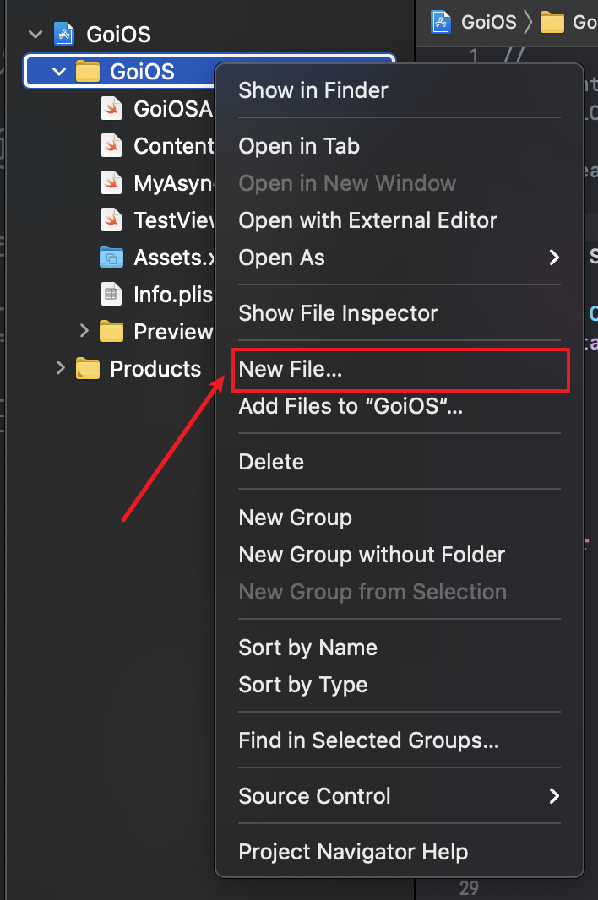
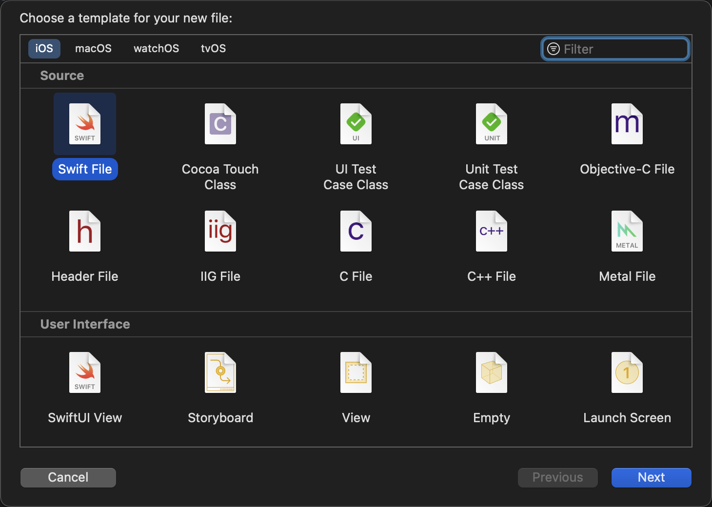
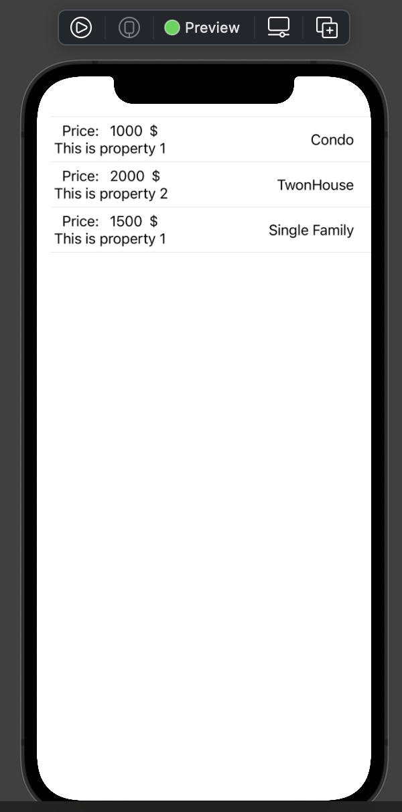

1. this unordered seed list will be replaced by toc as unordered list
{:toc}

## Let's create some example data first!

For creating a structure of data (or sometimes in a formal name as "MODEL") first, we need to create an empty Swift file. Just as mentioned in the last post, we right-click on the folder you want to put the new file in and click on `New File...`, just as the image shown below:



After the popup window showing up, you select `Swift File` this time, like this:



Then you follow the instruction given by Xcode to create a new file. I named the file as `ListData.swift`. You can have whatever name you want it to be.

## Let's define a class and enum to represent our data!

I created the data structure like this:

``` swift
// file: 'ListData.swift'
...
enum PropertyType {
    case Single
    case TownHouse
    case Condo
}

class Property {
    var price: Int
    var description: String
    var type: PropertyType
    
    init(price: Int, description: String, type: PropertyType) {
        self.price = price
        self.description = description
        self.type = type
    }
}
```

What I want to define here is a data for housing (property). Just assume we only need to fill in minimum data for simplicity. Here, we need a `price`, a `description`, and a `type`. `type` itself is an enum, standing for 3 different types of housing type. If you are not familiar with `enum` and `class`, you might want to go through [enum doc](https://docs.swift.org/swift-book/LanguageGuide/Enumerations.html) and [class doc](https://docs.swift.org/swift-book/LanguageGuide/ClassesAndStructures.html) first. These two documents are pretty thorough and long. You don't have to know all the details to continue, but at least some gists of it.

After defining the structure of data (model), we now can instantiate some elements in a list.

## Declare a list of data.

Open a new SwiftUI view just as what we did in the last post, or simply work on the SwiftUI view we created last time. This is your choice. You can declare the list and instantiate several elements like this:

``` swift
...
struct DisplayList: View {
    @State var listInfo: [Property] = [
        Property(price: 1000, description: "This is property 1", type: .Condo),
        Property(price: 2000, description: "This is property 2", type: .TownHouse),
        Property(price: 1500, description: "This is property 1", type: .Single),
    ]
    ...
}
```

All these elements are hardcoded and just for brevity here. In the real world, you probably will never handle some data simple like this. You might need to read from the internet, read from the database. You might also need to modify the data or even "binding" some value to certain field. You will also need to figure out how to sync updated data to UI. These sentences I just mentioned might not make sense to you yet. This is totally fine. Don't worry about it. I will cover these concepts in the following posts. What I want you to know that what we do here is the most ideal case you may ever encounter.

Okay! With data prepared, we can figure out how to customize them in a `List`. Let's define the `body` of the SwiftUI view as following:

``` swift
...
var body: some View {
    List(listInfo, id: \.self) { property in
        Text(property.description)
    }
}
...
```

The Xcode will panic and throw errors to you, like:

> Initializer 'init(_:id:rowContent:)' requires that 'Property' conform to 'Hashable'

This error code might be a bit challenging for you if you are new to Swift. Basically, what it's saying is Swift compiler doesn't know how to create a id based in `\.self`. There is one thing I didn't mentioned in the last post. I briefly mentioned in the last post that `id: \.self` will let each element create a id based on itself and then `List` will be able to refer to this id. The main question here is what exactly the generated id is? The answer is the id is a hashed value. In the last post, `String` class confirms to `Hashable` protocol, which requires an implementation of a hashing function and of course `String` class implements this `Hashable` protocol. The auto generated id is actually the hashed value returned by the hash function implemented by `String`. In this case of self-defined class, where we didn't conform to `Hashable` protocol and didn't implement the hash function, the swift compiler won't be able to get the id. Hence, in order to solve this error, we can confirm to `Hashable` and make a hash function.

However, I'd like to introduce another more common approach in this case.

## Introducing `Identifiable` protocol!

`Identifiable` protocol is quite simple actually. It only requires your class to have one addtional property named as `id`. You can easily conform your class to `Identifiable` like this:

``` swift
// file: 'ListData.swift'
class Property: Identifiable {
    // NEW
    var id = UUID()
    
    var price: Int
    var description: String
    var type: PropertyType
    
    ...
}
```

After you conforming your class to `Identifiable`, you have to create a new property called `id` and assign some value to it. The `id` should be unique (not quite accurate though, as being unique with certain conditions is also valid). For simplicity, I used `UUID()` function to assign a unique id here.

Now we move back to our SwiftUI view and we can remove the `id:` parameter! Code should be like this:

``` swift
...
List(listInfo) { property in
    Text(property.description)
}
...
```

You can see we don't need to tell `List` which id to use as long as the list we passed in conforms to `identifiable` protocol. In that case, `List` will automatically look for the `id` field inside the class to use.

## Now let's do some customization!

You can be creative here, but that's what I did:

``` swift
...
var body: some View {
    List(listInfo) { property in
        HStack {
            VStack {
                HStack {
                    Text("Price: ")
                    Text(String(property.price))
                    Text("$")
                }
                Text(property.description)
            }
            
            Spacer()
            
            switch property.type {
            case .Condo:
                Text("Condo")
                
            case .TownHouse:
                Text("TwonHouse")
            
            case .Single:
                Text("Single Family")
            }
        }
  }
}
...
```

With the code above, the preview shall be something like this:



You might notice something off about the alignment of "Price" and "This is property ...". The reason is `VStack` by default apply the center alignment across all elements inside it. We can change that to `.leading` alignment. Code is shown below:

``` swift
...
var body: some View {
    List(listInfo) { property in
        HStack {
            // NEW alignment argument
            VStack(alignment: .leading) {
                HStack {
                    Text("Price: ")
                    Text(String(property.price))
                    Text("$")
                }
                Text(property.description)
            }
            ...
        }
  }
}
...
```

Now go back to check preview. It should look better now!

## Ending

This is just a simple touch about the power of SwiftUI with `List`. You can do lots of power things and of course beautiful things with just several tweaks. The next post should be relative brief. I will go over the SF Symbol, a power font/icon system created by Apple. With SF Symbol, which already comes with Apple devices natively, you can easily add icon into your app. Stay tuned!

Continue with [SF Symbol](sf_symbol.md){:.heading.flip-title}
{:.read-more}
