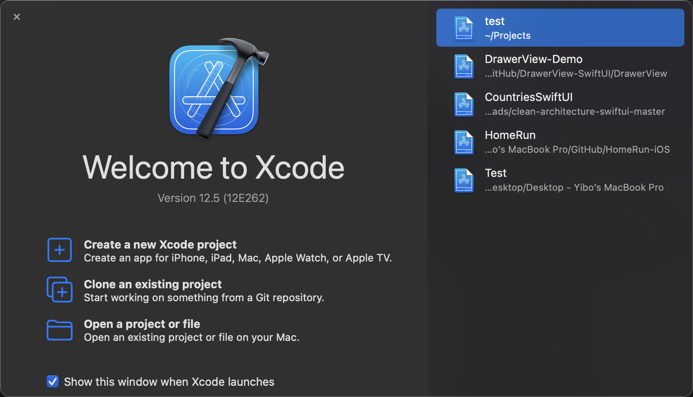
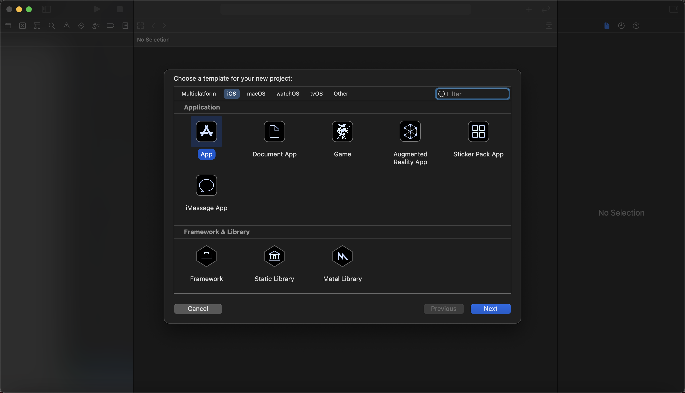
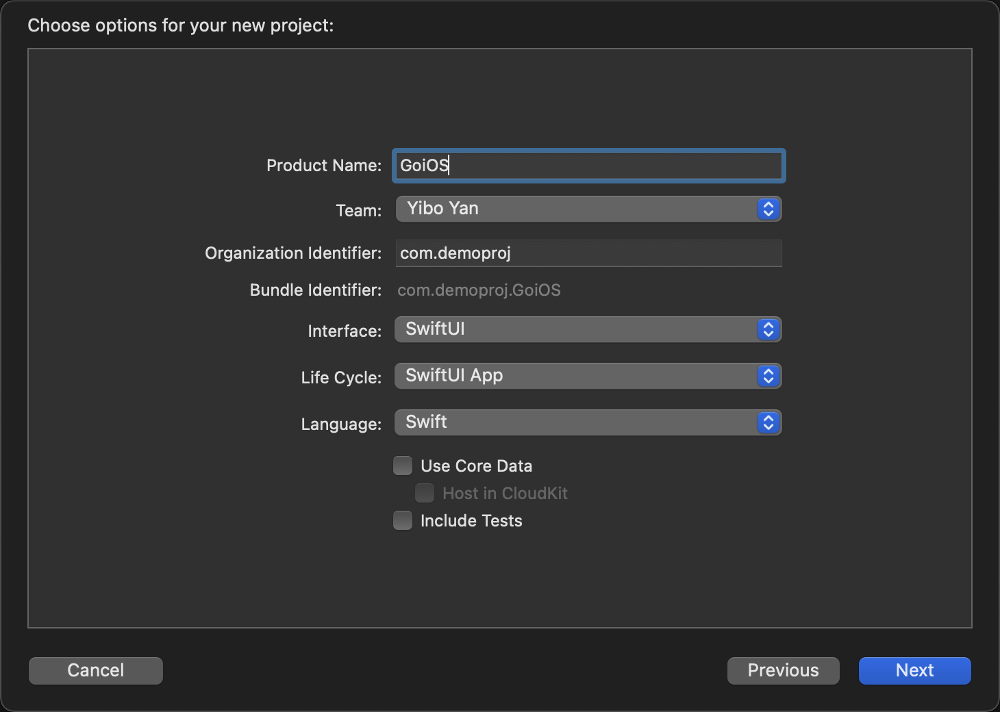
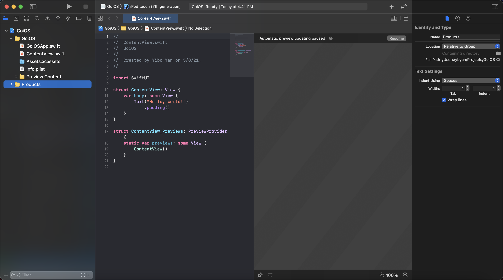
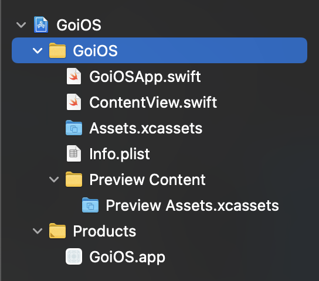
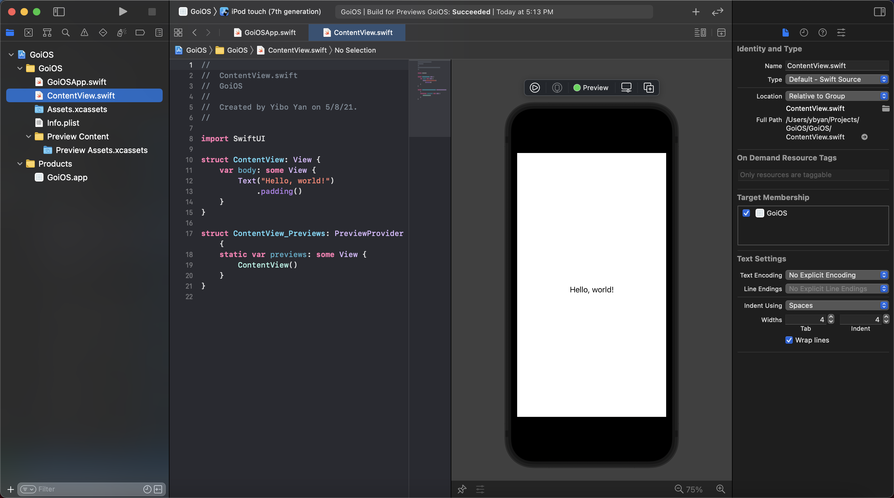
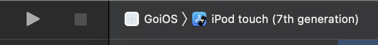

## Prerequisites

- You may need a Mac, if not, you at least need a virtual machine which can run MacOS, as we will be doing native iOS development.
- You need to download the latest version of Xcode from Mac's [app store](https://apps.apple.com/us/app/xcode/id497799835?mt=12). 
- Sometimes you may need to upgrade to the latest version of MacOS to download the latest Xcode.

## Let's create a project!

After you finished downloading or upgrading for the **Prerequisites** part, you are all ready for creating a new iOS project! Let's do it!

### How to create a new project with Xcode?

Start the Xcode and you will see a welcome view. Like this:

On the right hand side, it lists all recent projects I have opened. On the left hand side, this is a view where you can create a new project, clone and open from existing projects. We will not touch the rest two options. Let's click on the **`Create a new Xcode project`**!

You will see a popup window like this:

Under the title `Choose a template for your new project`, you can see you have several options for creating a new project targeting at different platform. Since we are majorly focusing on iOS, so we select the `iOS` as our target platform. Below, there is a view listing all avaliable boilerplates for what kind of app you want to create. We choose the `App` one, which will create a vanilla codebase for us. Note: this will still create several boilderplate code files to make sure your "empty" project can start and running.

After clicking `Next`, a new popup window will appear. Like this:

- `Product Name`: Just the name for your app project. You can choose whatever you want.

- `Team`: You can simply choose `None`, which is default, if you haven't enrolled in Apple Developer Program.

- `Organization Identifier`: Actually, you can choose whatever you want, as long as it conforms to [this standard](https://developer.apple.com/documentation/bundleresources/information_property_list/cfbundleidentifier) required by Apple. However, by convention, we usually write it as the reverse order of our domain. For example, if I have a domain as `www.totoroq.com`, I can write it as `com.totoroq.www` as my organization id by convention.

- `Bundler Identifier`: It is the combination of organization identifier and product name combined by a dot between them. This bundler id should be unique, otherwise you might have some trouble in some operations. You can change product name or organization id if your bundle id is not unique.

- `Interface`: This is indicate how you will construct the user interface. The old approach is `Storyboard`. In this series of tutorial, we will majorly use SwiftUI. Hence, we select `SwiftUI` here.

- `Life Cycle`: We choose `SwiftUI` here, which is introduced in iOS 14. The old one is `Storyboard`. Life cycle indicates how to handle state transition in the entire running cycle of your app. If you don't quite understand it for now, no worries, we might get to that later.

- `Language`: This is the programming language you want to use to program your app. We choose `Swift` here. `Objective-c` is the old choice for writing iOS app. We will focus on Swift here.

*Note: We will not go through `Core Data` and `Tests` here, so just leave them unchecked.*

When you correctly fill up all field, click `Next` to preceed. After that, you will see a popup window to ask you to pick the location of storing the files. Go pick the location you want, and click `Create` to create your project!

### Meet with Xcode interface

Congrat! You've created a new iOS project. You shall see a new Xcode window is opened for you, like this:

- On the left hand side is named as **Navigator**, where you can view the file structure of your project. *(This is not always how files really organized in your folder, since Xcode organizes files in its own way.)* Besides viewing and navigating different files in the **Navigator**, you can also switch to different tabs to view different functionalities. More details will be discussed in the future posts.

- On the center, you will see a big area of editor (including the **Preview Area**). This is main area where you usually coding and editing. The preview area will be used to preview your SwiftUI view. More details will be discussed in the future posts.

- On the right hand side is named as **Inspector**. Inspector is important panel when you are dealing with Storyboard, where lists all details information to let you adjust the properties of a storyboard view. For the SwiftUI, the functionalities of inspector panel is largely reduced. However, you can still adjust some SwiftUI view properties through this inspector panel, though I tend to directly do on my code. This is just a personal choice.

## Let's get some basic ideas about all template files created by Xcode

Let's focus on the file trees in the **Navigator**, you will see something like this:

These are all template files created by Xcode to make you app runable. `Product` folder is the folder which contains the build executable file of your app. Let's focus more on `GoiOS` folder which is main folder containing all esssential files. We will touch `Preview Content` yet.

- `GoiOSApp.swift`  
  This file is the main entry of entire app. You can consider it as the `main` function of a cpp or java program.

- `ContentView.swift`  
  This file is a SwiftUI view file. This type of files contain views (can be one or multiple views). For this specific file, it contains a text in the center of screen. You can see in the `GoiOSApp.swift` file, it references the view defined in `ContentView.swift`. This means it will display the view defined in the `ContentView.swift` as the initial view of your app.

- `Assets.xcassets`  
  This essentially is a folder. This can be used to organize all assets of your app. For example, some icons and images.

- `Info.plist`  
  This file contains some basic information and capabilities declaration of your app. More details might be discussed in the future posts.

## Let's try to preview and run our app!

### Try out preview!

First, navigating to the `ContentView.swift` file by double clicking it inside the navigator. You shall open a editor with a preview side-by-side. If the preview is not ready for you, you can click the `resume` to resume the automatical preview.

You probably will see something like this:

You can see the little phone view inside the preview panel with the simple view.

### Try out running inside a simulator

This is not quite accurate. When you preview, it actually also run inside a simulator. However, in the preview panel, the update in the code will be automatically previewed inside the preview panel, namely "hot reload" or Apple simply call it "automatically preview". Let's run it inside a separate iPhone simulator.

Let's find the UI looks like below:

You can click the `iPod touch` one to select which simulator you want to use. Then you can click the triangular run button to start a simulator and run your app inside it when it successfully booted up. The square button is used to stop your app inside the simulator.

## Ending

Alright! I believe you can already create a brand-new iOS project on your own! That's all for this post. See you next post!

<!-- 
Continue with [Config](config.md){:.heading.flip-title}
{:.read-more} -->
