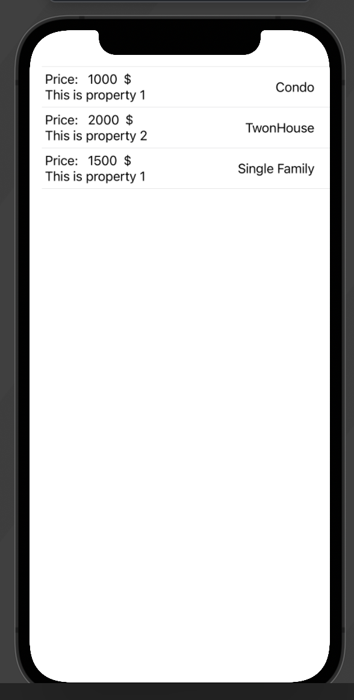
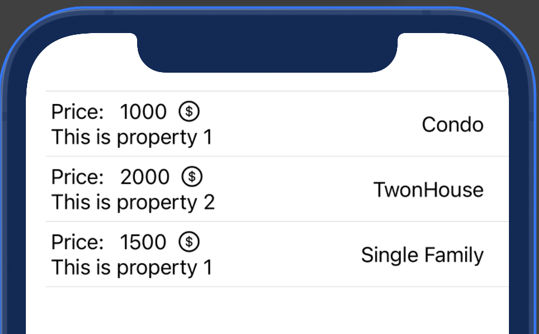
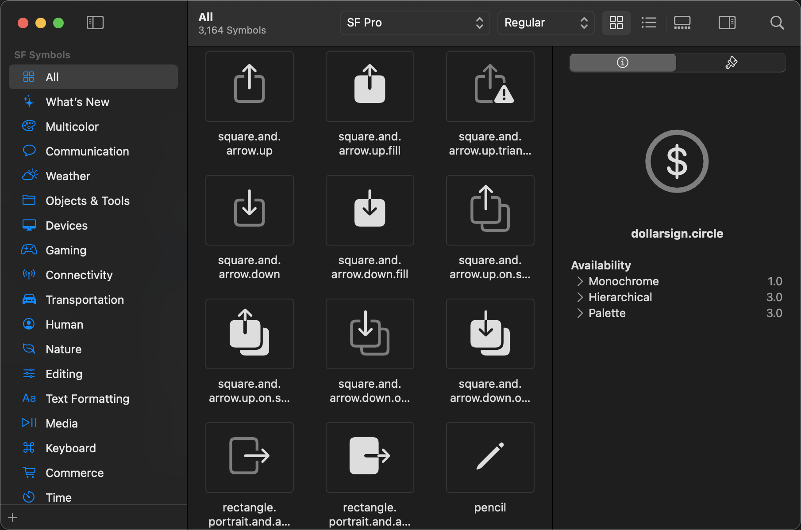
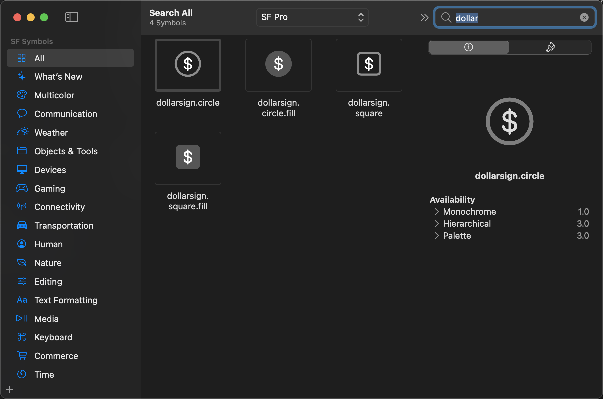
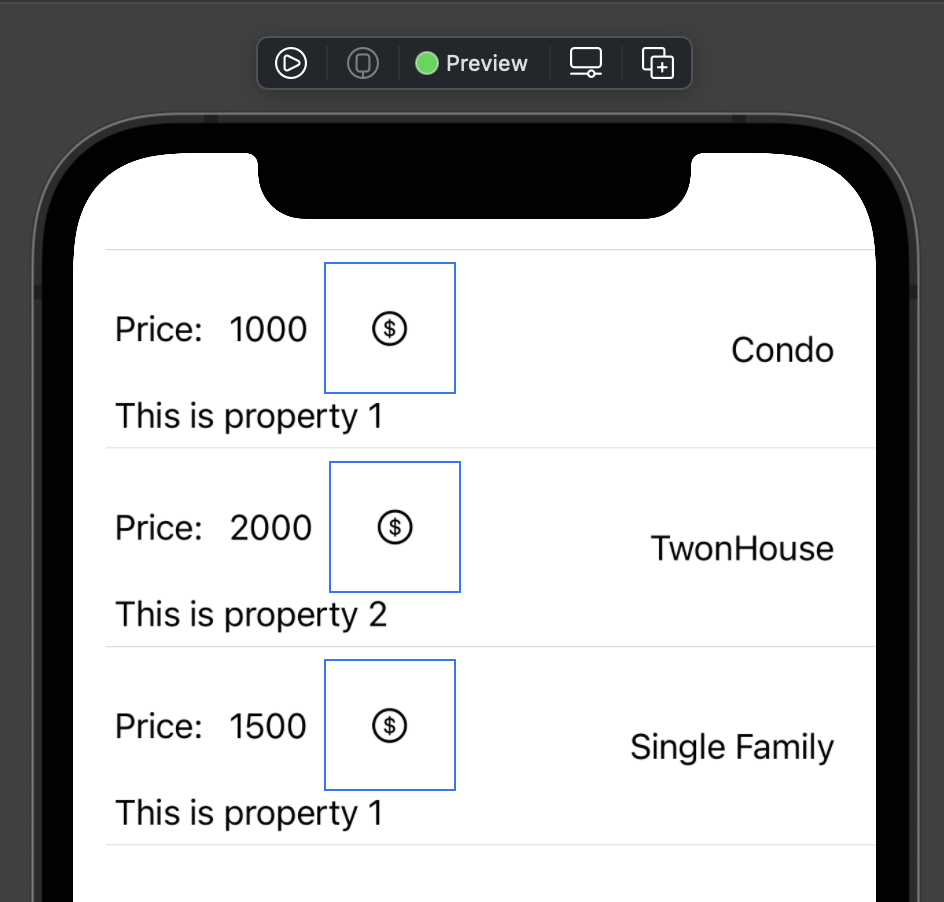

1. this unordered seed list will be replaced by toc as unordered list
{:toc}

## How to add SF symbol icon?

In this time, we will directly work on the view we have worked on in the last post. Let's open up the old view we used last time. The entire code block is like this, in case you have lost the source code:

``` swift
// file: DisplayList.swift

import SwiftUI

struct DisplayList: View {
    @State var listInfo: [Property] = [
        Property(price: 1000, description: "This is property 1", type: .Condo),
        Property(price: 2000, description: "This is property 2", type: .TownHouse),
        Property(price: 1500, description: "This is property 1", type: .Single),
    ]
    
    var body: some View {
        List(listInfo) { property in
            HStack {
                VStack(alignment: .leading) {
                    HStack {
                        Text("Price: ")
                        Text(String(property.price))
                        Text("$")
                    }
                    Text(property.description)
                }
                
                Spacer()
                
                switch property.type {
                case .Condo:
                    Text("Condo")
                    
                case .TownHouse:
                    Text("TwonHouse")
                
                case .Single:
                    Text("Single Family")
                }
            }
            
        }
    }
}

struct DisplayList_Previews: PreviewProvider {
    static var previews: some View {
        DisplayList()
    }
}
```

The preview of our last work is something like this:



It seems the layout is pretty boring right now. How about adding some visual assets, like icons? Right! I think we can replace the dollar sign with an proper dollar icon. Let's pinpoint the corresponding code block of this dollar sign and replace the original `Text` with something like this:

``` swift
VStack(alignment: .leading) {
    HStack {
        Text("Price: ")
        Text(String(property.price))
        // Text("$")
        Image(systemName: "dollarsign.circle")
    }
    Text(property.description)
      
}
```

After doing so, then try to preview it now. It should be something like this right now:



Look a bit nicer! But you might ask, how am I suppose to know which one to use and what kind of option I have. Apple has done the job for us!

## Introduce SF Symbol App on MacOS!

Apple releases an app named as `SF Symbol`, which can be installed on your Mac. You can go to this [Apple website](https://developer.apple.com/sf-symbols/) to find the proper link for downloading and installing. When this post is written, I use SF Symbol 3 (beta channel), so what I display to you is SF Symbol 3 beta app. What you actually use might be a little different than mine.

After installing the SF Symbol, let's launch the app and check out what it is. It should be something like this:



As you can see, this app displays all icon previews for you at one place. You can even search icon by clicking the search icon on the top right corner of it. For example, let's do a search about "dollar", you might get something like this:



You can see below each icon preview, you will have a string corresponding to it. This is the id you will use to tell SwiftUI which icon you have to use. Take the first dollar sign in the picture as an example, the name is `dollarsign.circle`. The syntax in SwiftUI to add this icon is using `Image()` control just as you have seen in the code above. The exact syntax is:

``` swift
Image(systemName: "YOUR-ICON-NAME")
```

Replace the `YOUR-ICON-NAME` with the actual name that you find in the SF Symbol app. You can test it out by using a different icon. Just be creative here.

## Play around!

### Resize the symbol by using `.frame()`

Resizing an image or icon is a common operation. In SwiftUI, when you want to specify the size of a view, you need to use `.frame()` view modifier. For example, you can do this:

``` swift
...
Image(systemName: "dollarsign.circle")
    .frame(width: 64, height: 64)
...
```

However, you might see the icon border indeed takes more space, but the size of the icon itself didn't actually increase. Like this:



The reason is that the `Image()` view, by default, won't let the image inside it to be freely resized. Even though you specify and increase the frame, the icon itself won't automatically fill up the availiable space. To handle this, you need use `.resizable()` view modifier first, like this:

``` swift
Image(systemName: "dollarsign.circle")
    .resizable()
    .frame(width: 64, height: 64)
```

Now, let's check the preview again, it should be properly resized now.

### Another (idiomatic) approach of adjusting symbol size

Although the previous approach of using `.frame()` possible, but this is actually not really recommended way of doing so. Why is that? Let's think about where you usually use icon. Icons often appear in the UI alongside with some texts. In this sense, icons shouldn't be treated as image, instead, they should be treated as text! Hence, more idiomatic way of sizing the icon is using a sizing system which corresponding to the sizing system of the text. Luckily, Apple already handled this for developers. In the Apple text sizing system, there are several types of text with different sizes. For more detail, you can check out this [document](https://developer.apple.com/design/human-interface-guidelines/ios/visual-design/typography/) under the section - "Dynamic Type Sizes".

To use the sizing system for your SF symbol icon, you can simply do this:

``` swift
Image(systemName: "dollarsign.circle")
    .font(.footnote)
```

In this case, it will use `footnote` size. You can also try, for example, `.largeTitle`. There are several options to use. Try them out!

### Change icon color

Change the color of SF symbol is quite easy. You can use `.foregroundColor()` view modifier to achieve this. For example, you can do this:

``` swift
Image(systemName: "dollarsign.circle")
    .resizable()
    .frame(width: 64, height: 64)
    .foregroundColor(.green)
```

By doing this, you can see all dollar sign icons turn to the green.

**Note:** this `.foregroundColor()` also do the job for `Text()` view. If you want to change the font color of a `Text()` view, you can also use the `.foregroundColor()` to achieve so.

### More to come for SF Symbol 3 and iOS 15

For SF Symbol 3 and iOS 15, Apple added several really cool featrues. However, I won't cover these here right now, as by the time I wrote this, SF Symbol 3 and iOS 15 are still in the beta release. Once the API is settled, I will update this section to add more fun stuff!


## Ending

That's all for this post. SF Symbol is really cool for developers who want to easily use icon system in your app. In this post, I also briefly introduce the `Image()` view. However, `Image()` view actually is quite complex behind the scene. In the future post, I might cover this view again to go more details about it. Stay tuned!

Continue with [Two-way Binding](two_way_binding.md){:.heading.flip-title}
{:.read-more}
