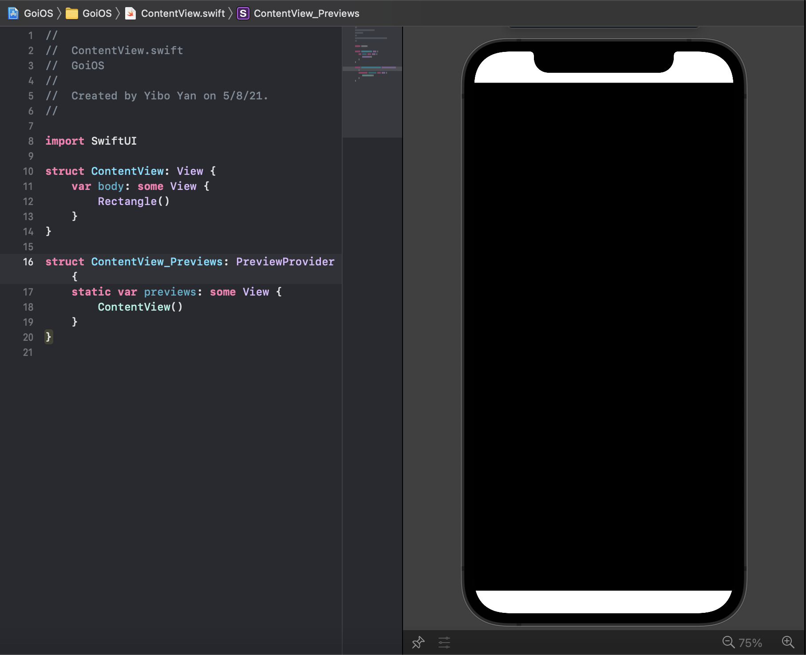
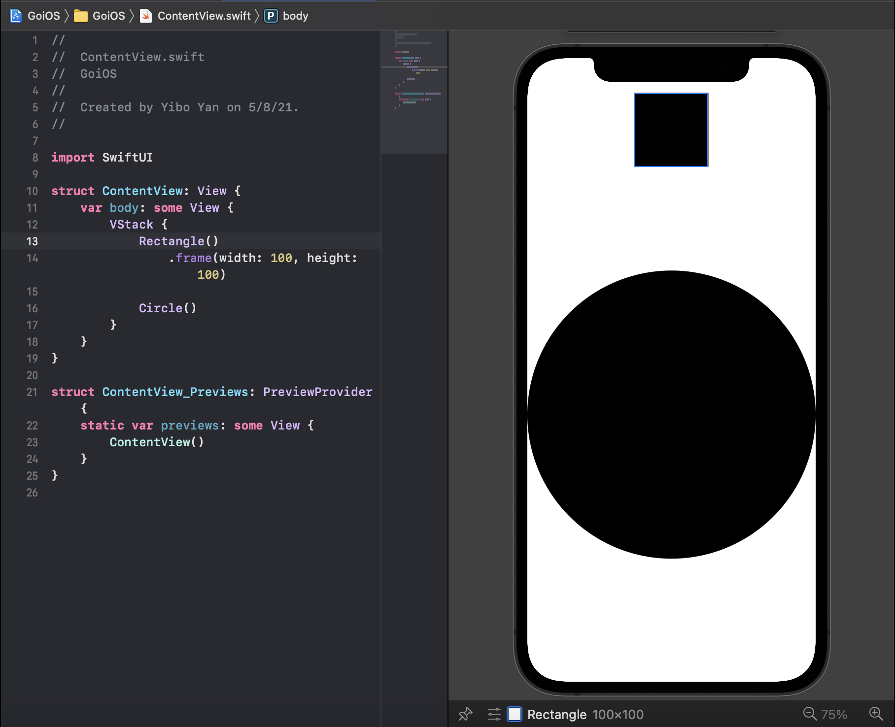

1. this unordered seed list will be replaced by toc as unordered list
{:toc}

## Create a `Rectangle`!

Let's open up `ContentView.swfit` files. Replaces all `Text` views with a `Rectangle` declaration. Like this:

```swift
// file: 'ContentView.swift'
...
struct ContentView: View {
    var body: some View {
        Rectangle()
    }
}
...
```

After that, you will see the preview be like this:



You can see there is a black filled rectangle on the screen. But what if we don't want such a big one? How about make it a smaller one? Let's explore more about `ViewModifier`

## What is `ViewModifier`?

As the name, the `ViewModifier` modifies a view. The concept is that easy. For example, you already seen in the template code `.padding()`, which is a `ViewModifier` creating an automatically calculated padding around a view.

You might think this `.padding()` format is kind of familiar. What's that? This is function call of member method on an instance! That's exactly what `ViewModifier`s are. They are essentially member functions which returns a new `View`.

## How to use `.frame()`?

Now, let's try to make the `Rectangle` smaller. We can use `.frame()` to specify how big we want a view to be.

Try something like this:

```swift
// file: 'ContentView.swift'
...
struct ContentView: View {
    var body: some View {
        Rectangle()
            .frame(width: 100, height: 100)
    }
}
...
```

You will see the `Rectangle` has already been resized to a square with both height and width as 100 **points**. Apple calls this unit as UIKit **points**, instead of raw pixel, as Apple did some conversions behind the scene to make sure the UI will look as nature as possible on different size of screen.

Ok, so far you have already known how to specify the size(frame) of a view. You can utilize the Xcode's autocompletion to explore more options provided by `.frame()`. You can set the `maxWidth`, `minHeight`, and lots of other properties by using this `ViewModifier`.

## Let's create a `Circle`!

Add a `Circle` into our `ContentView.swift`, and wrap both `Circle` and `Rectangle` into a `VStack` (recall from previous post.) Like this:

```swift
// file: 'ContentView.swift'
...
struct ContentView: View {
    var body: some View {
        VStack {
            Rectangle()
                .frame(width: 100, height: 100)
            
            Circle()
        }
    }
}
...
```

And the preview will be something like this:



**Note: by default, `Shape` will take as much space as they can, if no frame is specified.**

So far so good? Everything for now should be easy.

## Let's make it looks a bit different by applying different colors!

Now, introduce another ViewModifier --- `.fill()`. This one can change the fill color of a `Shape`.

Write something like this:

```swift
// file: 'ContentView.swift'
...
struct ContentView: View {
    var body: some View {
        VStack {
            Rectangle()
                .fill(Color.red)
                .frame(width: 100, height: 100)
            
            Circle()
                .fill(Color.green)
        }
    }
}
...
```

You shall see two shapes now have different colors. There are two things need some attentions.

1. You might realize that the `ViewModifier` can be chained. This is actually totally make sense. Think about `ViewModifier` as a member functino of `View` *(this is not quite correct, as `View` is a protocal. Keep in mind for now)*. `ViewModifier` returns a `View`, so it also have lots of `ViewModifier` to call. This is how chaining works.

2. Another thing is the order. Even though as discussed on the first point that `ViewModifier` can be chained, the order indeed matters. However, the matter of order doesn't always refer to the same thing. In this case, `.fill()` can not appear after `.frame()`. Why is that? First of all, you need to know, `Shape` is also kind of a `View`, as it implements the `View` protocol. The nuance is `.fill()` works on a `Shape`, but `.frame()` works on a `View`, and they both return a `View`. When you execute the `.frame()` first, it will get a `View` back. At this point, SwiftUI will not be able to tell whether the `View` is actually a `Shape` or other things, considering lots of other UI components also implement the `View` protocol, such as `Text`. In this situation, you have to put `.fill()` before `.frame()`.

    > This is another situation when the order matters, that's related to the order about how `View` are produced. More details will be covered in the future posts.

## Let's stack both shape with a `ZStack`!

I believe you alraedy know about the usage of `VStack`, so let's try about `ZStack`. Changing your `VStack` to `ZStack`.

Now, you shall see the `Rectangle` is placed behind the `Circle`. Recall from the last post. The `ZStack` will place the `View`s from the behind to the front based on the order of declaration in the file.

What if we want to move the `Circle` a bit to see the `Rectangle` behind it?

## Introduce `.offset()` ViewModifier!

Try out the `.offset()` ViewModifier. Like this:

```swift
// file: 'ContentView.swift'
...
var body: some View {
    ZStack {
        Rectangle()
            .fill(Color.red)
            .frame(width: 100, height: 100)
            
        Circle()
            .fill(Color.green)
            .offset(x: 0, y: 200)
    }
}
...
```

`.offset(x: 0, y: 200)` will move the `Circle` to the positive x direction with 0 point, and to the positive y direction with 200 points.

> In the iOS world, the *trailing direction* is the positive direction of x, and the *bottom direction* is the positive direction of y. Recall from the last post about the definition of `trailing` and `leading`.

Now, you shall see a part of red `Rectangle` shows up.

## Ending

That's all for this post. Hopes you enjoy the fun of `ViewModifier`. You can utilize the Xcode's autocompletion to see all possible `ViewModifier`s of a View. Bye!


Continue with [Use Button](button.md){:.heading.flip-title}
{:.read-more}
