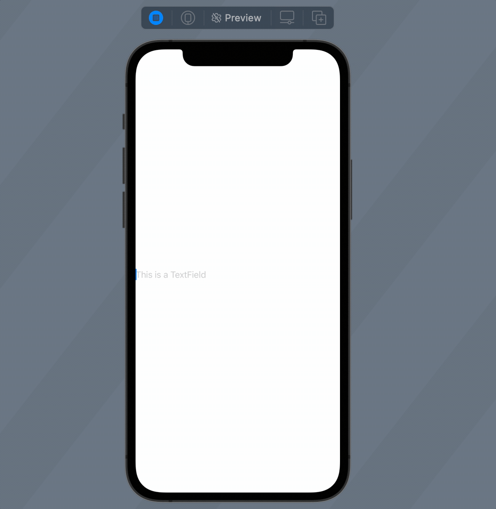
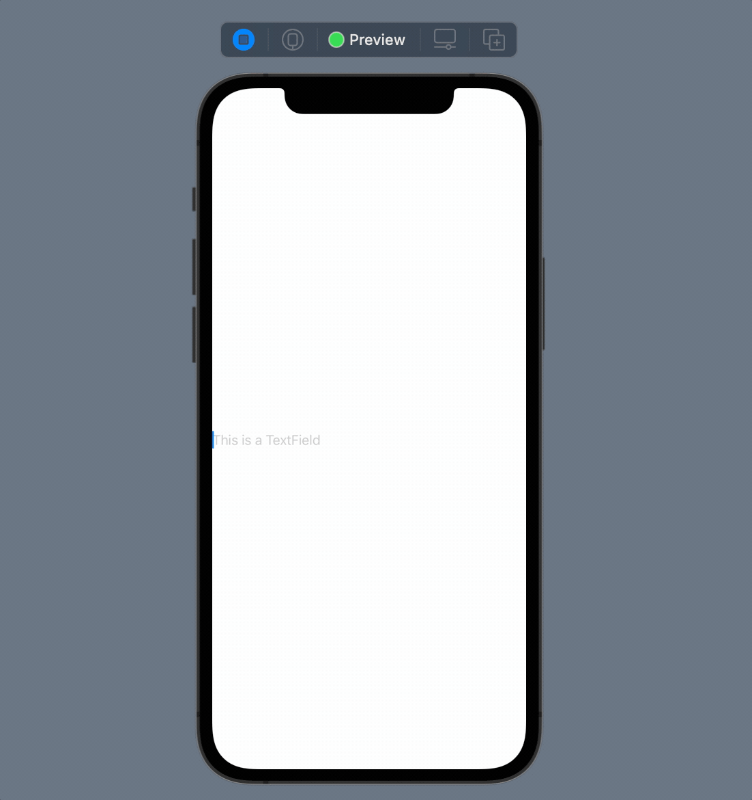
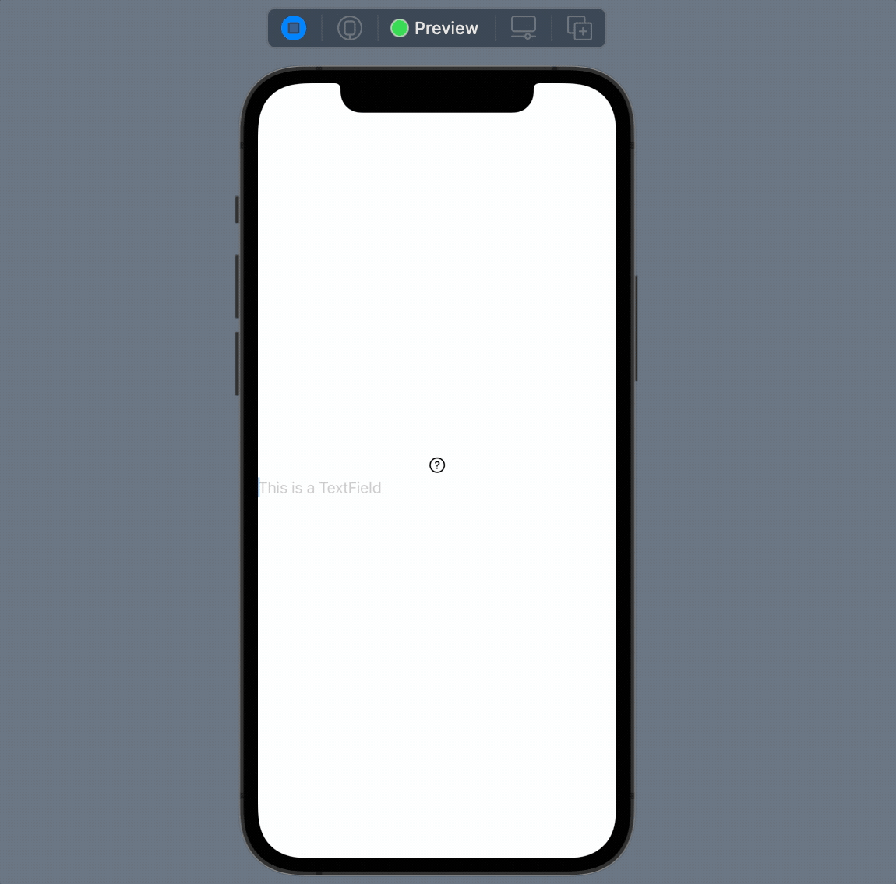
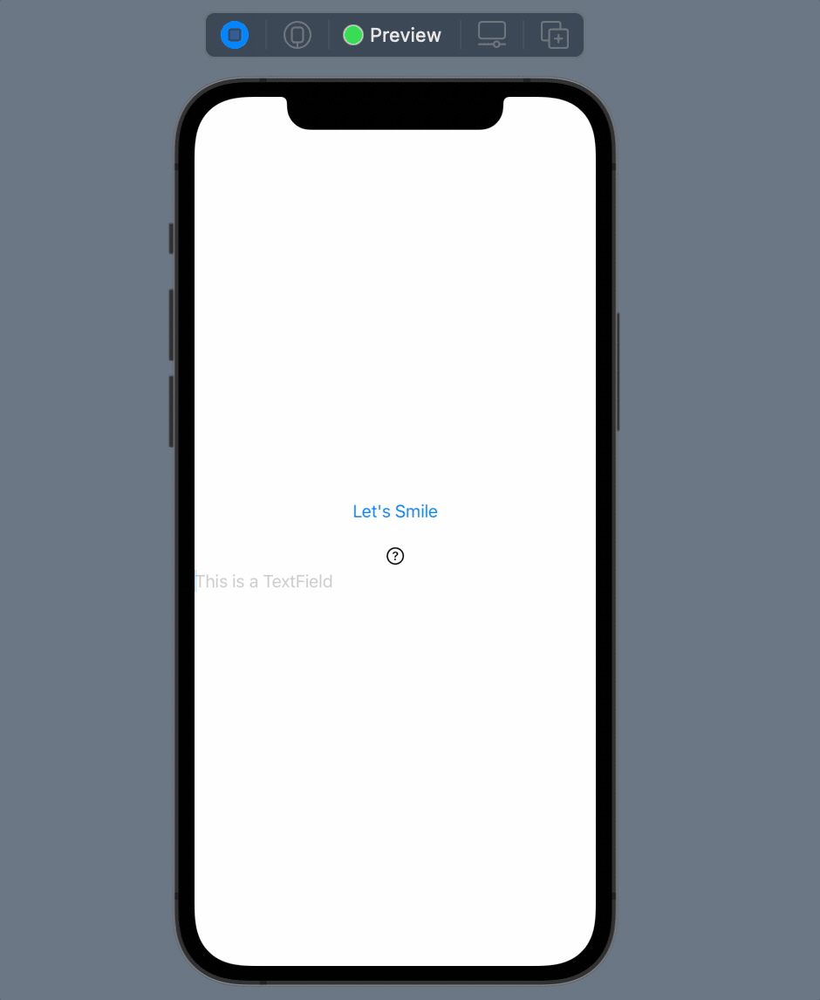

1. this unordered seed list will be replaced by toc as unordered list
{:toc}

## Introduce `TextField`

Before getting into "Binding" directly, let's take a look at `TextField` first, where the idea of "Binding" is oftenly used.

`TextField` is quite common and useful control in iOS app or any app around the world. It let you be able to input text. Declaring a `TextField` is quite easy. The syntax is like following (in a new SwiftUI view file I created):

``` swift
...
struct TryBinding: View {
    @State var myText: String = ""
    
    var body: some View {
        TextField("This is a TextField", text: $myText)
    }
}
...
```

There are new things here. No worries, I will walk through them. First of all, the parameters passed into the `TextField`. The first parameter passed into the `TextField` is used to be displayed as the placeholder. The second parameter is an important one. Users can input text into the `TextField` and `TextField` needs a way to collect the text entered by users. The second parameter do the job. With `text:` set to `$myText` here, `myText` will be automatically assigned to the value entered by users. This is called "Binding". 

The dollar sign `$` is used to tell compiler to "bind" certain value. Since `myText` will be changed, it has to be mutable by using `var` keyword. Also, recall from the previous post, to make a field in SwiftUI view to be mutable, you need `@State`.

You can build and preview the `TextField`. The preview should be like this: 



## Dynamically display the entered content

As mentioned in the last section that the binding will update the `myText` variable once the input changed. Due to this, we can also easily display the input.

Let's try this:

``` swift
...
var body: some View {
    VStack {
        Text(myText)
            .foregroundColor(.blue)
        TextField("This is a TextField", text: $myText)
    }
}
...
```

Take a look at preview:



As you can see the input content get displayed dynamically in the `Text` with color blue.

Let's walk through about what happened behind the scene. We first use binding syntax with `$` to bind `myText` with the `TextField` view. In that way, variable `myText` will be updated with the user input. Since `myText` is marked as `@State`, all views that use this variable will be notified to update themselves once `myText` value changed. Here you go, the result we see here.

### Have more fun!

#### Display different views based on input

Displaying the user input seems boring. However, you can do lots of cool things. Let me show you some cases. For example, you can do something like this:

``` swift
var body: some View {
    VStack {
        if myText == "Smile" {
            Text("😃")
        } else if myText == "Cry" {
            Text("😭")
        } else {
            Image(systemName: "questionmark.circle")
        }
        TextField("This is a TextField", text: $myText)
    }
}
```

The preview should be like this:



#### Change user input with a `Button` click

You can also change user input on the fly. Try something like this:

``` swift
...
var body: some View {
    VStack {
        Button("Let's Smile") {
            myText = "Smile"
        }
        .padding()
        
        if myText == "Smile" {
            Text("😃")
        } else if myText == "Cry" {
            Text("😭")
        } else {
            Image(systemName: "questionmark.circle")
        }
        
        TextField("This is a TextField", text: $myText)
    }
}
...
```

Here is the preview:



With a button click, you can change the input text to "Smile". Besides, you can see the text inside the `TextField` is also changed. To put it into the nutshell, the change you made in the `TextField` will be applied on the variable `myText` and the change on the variable `myText` will also be applied on the `TextField`. This behavior of binding is usually called as "two-way binding". Let's explain a bit more in the next section.

## Some concepts about "Binding"

There are usually two concepts about binding, one-way binding and two-way binding. **Note: In the world of SwiftUI, every binding is two-way binding, no one-way binding here.**

- Two-way binding
  
  We have explained some details about two-way binding above. Basically, two-way binding means binding in two directions. The update on the view will also be applied on the binding variable. Also, the update on the binding variable will also be applied on the view.

- One-way binding

  One-way binding means update will only occur in one direction. In some other UI frameworks, they might have one-way binding option, where you might also need to specify wihch way you want to use. For example, you can specify the update flow only occurs from variable to view. Namely, the update on variable will be reflected on the view, but the update on the view will not be reflected on the variable. This one-way binding is not available in SwiftUI, so this is not actually an important concept for SwiftUI.


## Ending

That's all about binding. In the future post, we will explore some ideas of using `@Binding` to achieve two-way binding across different views. Stay tuned!


<!-- Continue with [Use Button](button.md){:.heading.flip-title}
{:.read-more} -->
